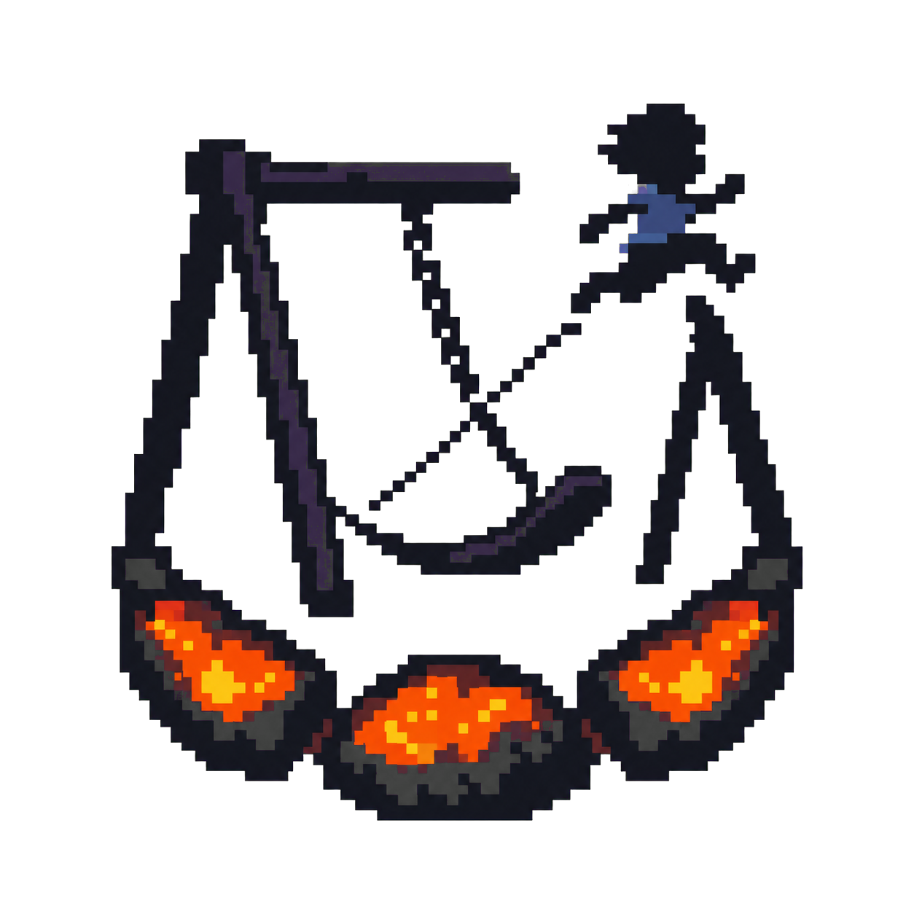

<p align="center">
  
</p>

<h1 align="center">Jumping on Coals</h1>

<p align="center"><strong>An original album about burnout, transformed into a tactile eight-chapter game.</strong></p>

<p align="center">
  <a href="https://jumpingoncoals.danielnash.co"><strong>Play the game</strong></a>
  ·
  <a href="https://www.youtube.com/watch?v=M3uy8KRM_-E"><strong>Watch the 2:45 demo</strong></a>
  ·
  <a href="https://devpost.com/software/jumping-on-coals"><strong>View on Devpost</strong></a>
</p>

[](https://www.youtube.com/watch?v=M3uy8KRM_-E)

`Jumping on Coals` is a 37–42 minute pixel-art web game about ambition, burnout, recovery, and the uneasy pull of familiar cycles. The player moves through eight tactile chapters while an original eight-song album supplies the structure, duration, and dramatic shape of the journey.

This repository is the OpenAI Build Week submission source. The album, concept, creative direction, and earlier three-chapter prototype all predate Build Week. The Build Week accomplishment is the accelerated transformation of that stalled prototype into a complete, coherent playable arc—not the creation of the original artwork.

## The story

Years ago, I was putting nearly all of my energy into work. I wanted to grow quickly, accomplish something meaningful, and leave a legacy. The work succeeded, but I was becoming angry, isolated, and creatively empty.

Then I took my first paid PTO day. It was a Friday. Over that weekend, I wrote the entire *Jumping on Coals* album.

As I composed, a visual story appeared. It begins with a child on a swing: repetitive, comfortable motion that keeps you safely above the ground. The moment you leave that familiar cycle, you land on hot coals. You have to keep moving because stopping means burning. Eventually you dig beneath the coals for relief, only to find yourself exhausted at the bottom of a hole. You recover, dig back out, and face one final question: do you leave, or climb onto the swing again?

The whole album was made from one cello pizzicato sound transformed through different effects. To me, that represents one person moving through different circumstances and emotional states. The game follows the same principle: it lets the player inhabit the cycle rather than simply hear me explain it.

## The album is the game

The music is not interchangeable background audio, and the game is not a rhythm game. Each non-looping song owns one chapter, sets its natural duration, and moves the environment through broad dramatic phases. When a song reaches silence, it exposes a final action or choice; it never automatically takes control away from the player.

1. **Back in the Swing** — build momentum, collect fireflies, and finally jump off.
2. **Losing Balance** — read environmental cues while crossing a narrow beam.
3. **Jumping on Coals** — manage Heat and Flow across a 26,400-pixel route while fire pursues you.
4. **Digging In** — keep working as productive effort becomes compulsion and exhaustion.
5. **At the Bottom** — use breathing, focus, and memory to recover the ability to stand.
6. **Digging Out** — turn alternating shovel strikes into a difficult ascent.
7. **By the Shovel** — rest beneath an opening sky and choose whether to leave or return.
8. **Back in the Swing (Again)** — return to a satisfying familiar motion and decide when to step away.

Several apparent exits also surface the thoughts that make burnout cycles difficult to leave: sunk effort, comparison, reputation, and identity. Leaving always remains possible, but the player must choose it deliberately. The final swing is mechanically satisfying and accompanied by a scored variation on the opening theme, leaving the player to decide whether returning feels like recovery, repetition, or both.

The full design contract and chapter acceptance criteria are in [GAME_DESIGN_DOCUMENT.md](./GAME_DESIGN_DOCUMENT.md).

## OpenAI Build Week transformation

The Git boundary for the hackathon story is commit [`619a147`](https://github.com/DanielNash1611/jumpingoncoalsgame/commit/619a147514e646b078c56c8a5cd0ee34b70db9c8), created January 10, 2026.

| Before Build Week | Built or substantially improved during Build Week |
|---|---|
| Original eight-track album and core visual metaphor | Complete eight-chapter playable sequence |
| Phaser, TypeScript, and Vite foundation | Six later scene implementations for collapse, recovery, escape, return, and leaving |
| Rough Swing, Losing Balance, and Coals vertical slice | Rebuilt swing and balance mechanics with readable player goals |
| Short, flat coal prototype | Deterministic 26,400-pixel traversal with Heat, Flow, checkpoints, memories, and a pursuing fire |
| Large WAV runtime payload | Browser-ready MP3 delivery reduced from roughly 397 MB to roughly 36 MB |
| Basic debug and input support | Responsive presentation, touch controls, pause/mute, shared narrative systems, and judge shortcuts |

For the exact code-supported before-and-after account, relevant files, validation evidence, and acknowledged limitations, see [BUILD_WEEK.md](./BUILD_WEEK.md) and the [chronological development log](./docs/build-week-development-log.md).

## How Codex and GPT-5.6 were used

I had imagined an interactive version of the album for years, but I did not have the game-development experience or budget to build it. During the GPT-5.2 era, I created a game design document with ChatGPT and attempted the first prototype with Codex. After a great deal of iteration, I had a useful foundation and rough versions of the first three chapters, but the physics, visuals, mechanics, and remaining album arc were not coming together. I stopped working on it.

About five months later, during Build Week, I returned with Codex, GPT-5.6, Goal Mode, and Sol. My first request was essentially: evaluate what is here, decide whether it should be rebuilt or continued, and make it work. Codex concluded that the existing prototype was a good foundation, improved it, and helped turn it into the first version that actually felt like the game I had imagined.

Codex served as the implementation partner for:

- analyzing the repository and turning the creative objective into staged acceptance criteria;
- implementing and connecting mechanics, audio, state, input, UI, transitions, and narrative choices across the full scene sequence;
- debugging TypeScript, physics, presentation, and browser behavior;
- iterating on mechanics from runtime feel rather than treating generated code as finished;
- validating the production build and creating an evidence-backed submission record.

GPT-5.6 was valuable because this was not one isolated coding problem. The mechanics had to express the music, scenes had to share state without losing player agency, recovery had to feel different from achievement, and the ambiguous ending had to work as an action rather than an explanation. GPT-5.6 helped sustain that larger context while Codex moved between physics, audio, visuals, state, narrative, and validation.

Goal Mode and Sol helped maintain focus across the dependent work needed to reach the end-to-end outcome. I worked with Codex conversationally—like a collaborator I wanted to play the game with—describing how a mechanic felt and what emotional purpose it needed to serve, then inspecting and refining the implementation.

Codex and GPT-5.6 did not originate the album, central metaphor, creative direction, or earlier prototype. They made it possible for an independent artist to carry an existing point of view into a medium that had previously been out of reach.

## Judge quick tour

The [public build](https://jumpingoncoals.danielnash.co) presents the intended uninterrupted experience. For a fast technical review, run the project locally and use the development-only shortcuts below.

```sh
npm ci
npm run dev
```

Open the URL printed by Vite, then press any key or tap once to unlock browser audio.

1. Press `1` for **Back in the Swing**. Pump with left/right and press `B` to inspect **Losing Balance**.
2. Press `2` for **Jumping on Coals**. Move and jump to inspect Heat, Flow, safe platforms, and the scrolling route.
3. Press `E` to reach **A shallow opening**. Choose `Leave the park` and confirm to see the second-thought sequence.
4. Press `4`, `5`, `6`, and `7` for the digging, collapse, recovery, escape, and reflection mechanics.
5. Press `8` for **Back in the Swing (Again)**. Dismount to inspect the leave-or-return branch.
6. Use `Shift+F9` in any full-track chapter to move to its final two seconds and prepare the real outro state.

Additional development controls:

- `R`: restart the current chapter
- `K`: put the current track into silence; chapter VIII also prepares its dismount gate
- `[` / `]`: move the current track backward or forward by 20%
- `G`: add a gathered light or collect optional coal memories
- `N`: cycle the eight album tracks
- `P`: toggle physics debug
- `` ` ``: toggle the runtime debug readout

## Controls

- `A/D` or `←/→`: pump, balance, move, aim, or change focus
- `W`, `↑`, or `Space`: release, jump, dig, breathe, dismount, or confirm
- `Esc`: pause
- `M`: mute
- Touch: on-screen direction and action controls appear on touch-capable devices

## Build and deploy

Requirements:

- Node.js 20.19 or newer in the Node 20 line, or Node.js 22.12+
- A current desktop or mobile browser with Web Audio and Canvas support

```sh
npm ci
npx tsc --noEmit
npm run build
```

The Vercel deployment uses `npm run build` with `dist` as its output directory.

## Technical overview

- **Stack:** Phaser 3, TypeScript, Vite, HTML/CSS, Arcade Physics, and Web Audio
- **Rendering:** 320×180 internal Phaser canvas with nearest-neighbor scaling beneath a responsive HTML HUD
- **Architecture:** scene-local mechanics connected through shared audio, run state, lifecycle, touch/story controls, breath pacing, narrative-choice flow, HUD, and visual helpers
- **Music:** eight non-looping tracks totaling roughly 37.5 minutes; playback progress drives broad dramatic phases rather than beat-mapped input
- **Runtime art:** `public/assets/backgrounds/`, `public/assets/sprites/`, and `public/assets/brand/`
- **Runtime audio:** compressed album files in `public/assets/audio-web/`
- **High-resolution sources:** `source_assets/backgrounds/` and `source_assets/sprites/`
- **Archival masters:** `source_assets/audio-masters/` locally; gitignored and not required to build

## Validation and known limitations

The Build Week milestone passed a clean dependency install, TypeScript compilation, the Vite production build, dependency audit, whitespace validation, and targeted browser smoke tests. See [BUILD_WEEK.md](./BUILD_WEEK.md) for the detailed evidence and the exact runtime paths inspected.

Known limitations:

- No automated unit or end-to-end test suite is configured.
- The complete natural-duration 37–42 minute path and every branch permutation have not been exhaustively tested in one run.
- Touch controls compile and render, but physical-device coverage remains limited.
- The production build emits a non-fatal warning for a large minified JavaScript chunk.
- The repository does not yet contain a formal license or asset-provenance document. Source, music, and visual reuse should not be assumed without permission from Daniel Nash.
- Pre-Build-Week Git history still contains the original large WAV blobs, so a fresh clone is larger than the current working tree suggests.

## Submission links

- **Play:** [jumpingoncoals.danielnash.co](https://jumpingoncoals.danielnash.co)
- **Demo video:** [Jumping on Coals: An Album About Burnout, Made Playable](https://www.youtube.com/watch?v=M3uy8KRM_-E)
- **Devpost:** [devpost.com/software/jumping-on-coals](https://devpost.com/software/jumping-on-coals)
- **Build Week evidence:** [BUILD_WEEK.md](./BUILD_WEEK.md)
- **Development chronology:** [docs/build-week-development-log.md](./docs/build-week-development-log.md)
